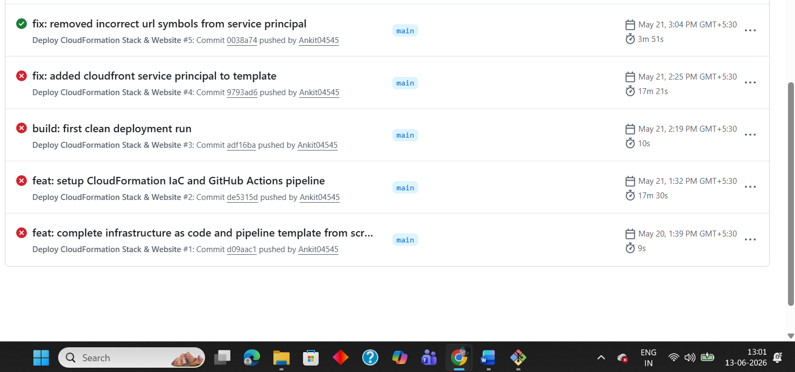
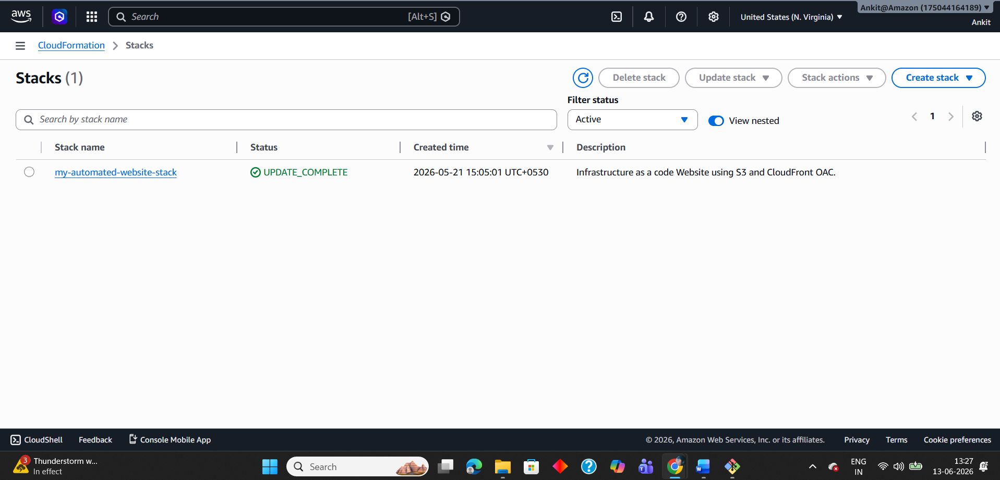
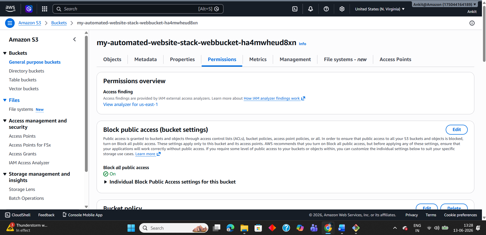
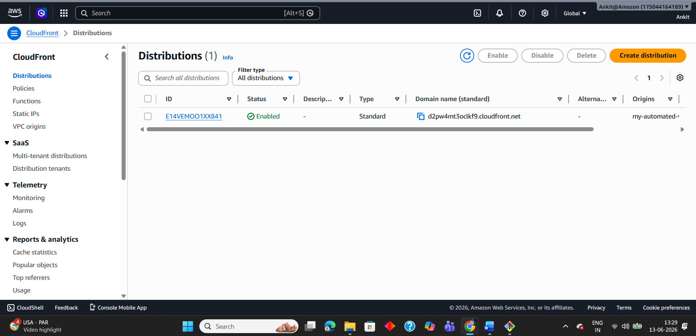
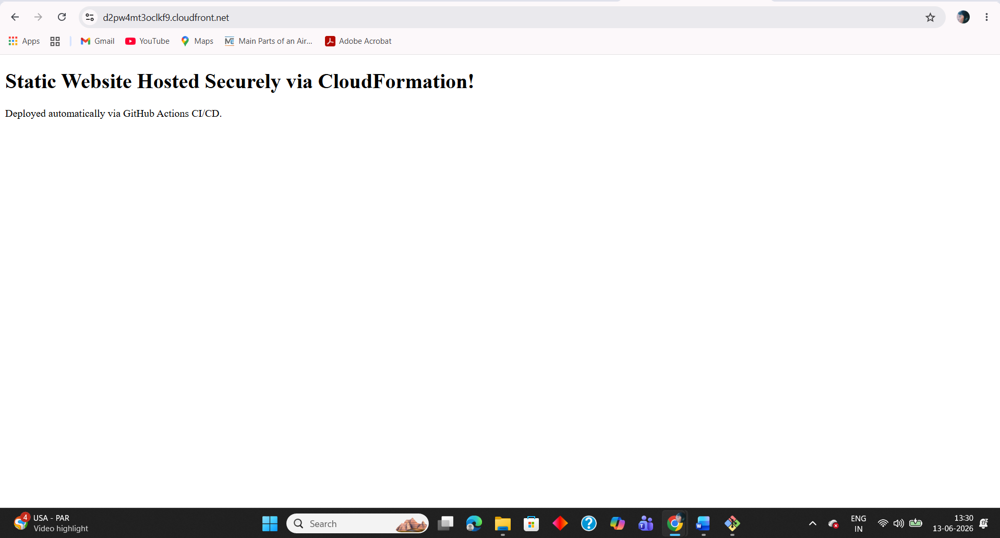

# Automated AWS Website Deployment

[](https://aws.amazon.com)
[](https://github.com/Ankit04545/Cloud-Automation-website.git)
[](https://aws.amazon.com/cloudformation)
[](https://d2pw4mt3oclkf9.cloudfront.net/)

A secure, serverless static website hosted on AWS — provisioned using Infrastructure as Code (IaC) via AWS CloudFormation and continuously deployed via a GitHub Actions CI/CD pipeline. No manual AWS console interaction required after initial setup.

**🌐 Live URL:**  https://d2pw4mt3oclkf9.cloudfront.net/

---

## 💡 Why I Built This

Most beginner AWS projects use the console manually — which doesn't reflect real-world cloud engineering. I built this project to practise **production-grade practices** from the start:
- Infrastructure defined entirely as code (no manual console clicks)
- Credentials handled securely via GitHub Secrets (no hardcoded keys)
- Deployments triggered automatically on every Git push
- S3 storage locked down — accessible only through CloudFront

---

## 📁 Repository Structure

```
├── .github/
│   └── workflows/
│       └── deploy.yml        # GitHub Actions pipeline configuration
├── cloudformation/
│   └── template.yaml         # AWS Infrastructure as Code template
├── images/
│   └── Cloud Architecture.drawio.png  # Architecture diagram
├── screenshots/              # Proof of deployment (AWS console screenshots)
└── src/
    └── index.html            # Website source files
```

---

## 🏗️ Architecture Overview

### Diagram


### Request Flow
```
User Browser → CloudFront (HTTPS, Port 443) → Origin Access Control (OAC) → S3 (Private Bucket)
```

### Component Description

| Component | Role |
|---|---|
| **GitHub Actions** | Triggers automated pipeline on every push to main branch |
| **GitHub Secrets** | Stores AWS credentials securely — never hardcoded |
| **AWS CloudFormation** | Provisions and manages all AWS infrastructure as code |
| **Amazon S3** | Private storage bucket — public access fully blocked |
| **Amazon CloudFront** | CDN serving content globally over HTTPS via OAC |
| **Origin Access Control (OAC)** | Ensures S3 only accepts requests from CloudFront |

---

## 📊 Key Results

- ⚡ Fully automated deployment achieved in **3 minutes 51 seconds** via GitHub Actions
- 🔒 S3 bucket inaccessible directly — all traffic served securely via **CloudFront HTTPS only**
- 🚀 Zero manual AWS console intervention on successful deployment
- 🔁 Successfully resolved a CloudFront service principal misconfiguration across **5 iterative pipeline runs**
- 🔑 AWS credentials managed securely via GitHub Secrets — zero hardcoded keys in codebase

---

## 🔒 Security Design

- **Private S3 Bucket** — public access blocked at bucket level
- **Origin Access Control (OAC)** — S3 bucket policy only allows requests from CloudFront, not direct access
- **HTTPS Only** — CloudFront configured to redirect HTTP to HTTPS (port 443)
- **GitHub Secrets** — AWS credentials stored as encrypted secrets, never exposed in code
- **Least Privilege IAM** — IAM credentials scoped to only required S3, CloudFront, and CloudFormation permissions

---

## 🚀 Getting Started

### Prerequisites

1. An active **AWS Account**
2. **IAM Credentials** with permissions for S3, CloudFront, and CloudFormation
3. A **GitHub Repository** to host this codebase

### GitHub Secrets Configuration

Add the following secrets to your GitHub repository under **Settings → Secrets and variables → Actions**:

| Secret | Description |
|---|---|
| `AWS_ACCESS_KEY_ID` | Your AWS IAM access key |
| `AWS_SECRET_ACCESS_KEY` | Your AWS IAM secret access key |
| `AWS_REGION` | AWS region (e.g. `us-east-1`) |

---

## 🔄 CI/CD Pipeline

### Trigger
The pipeline triggers automatically on any **push** to the `main` branch.

### Pipeline Stages

1. **Checkout Code** — Pulls the latest repository code into the runner environment
2. **Configure AWS Credentials** — Authenticates with AWS using GitHub Secrets (no hardcoded keys)
3. **Deploy CloudFormation Stack** — Creates or updates the stack `my-automated-website-stack`
4. **Sync Website Assets** — Syncs the `./src` folder to the S3 bucket, removing obsolete files
5. **Invalidate CloudFront Cache** — Clears CDN cache (`/*`) so updates go live instantly

---

## 🛠️ Development Workflow

To update the website and trigger an automated deployment:

```bash
# 1. Track your changes
git add .

# 2. Commit with a descriptive message
git commit -m "feat: update website content"

# 3. Push to main — pipeline triggers automatically
git push origin main
```

---

## 🌐 How to Find Your Live Website URL

1. Log in to the [AWS Management Console](https://console.aws.amazon.com)
2. Navigate to **CloudFormation**
3. Click on the stack named **my-automated-website-stack**
4. Select the **Outputs** tab
5. Locate the key **WebsiteURL** and click the link

---

## 📸 Screenshots
1. **GitHub Actions Pipeline**
   

2. **CloudFormation Stack**
   

3. **S3 Bucket Configuration**
   

4. **CloudFront Distribution**
   

5. **Live Website**
   
---

## 🚢 How to Deploy This Project

### Step 1 — Fork and Clone
```bash
git clone https://github.com/yourusername/aws-website-deployment
cd aws-website-deployment
```

### Step 2 — Configure GitHub Secrets
Go to your GitHub repo → **Settings → Secrets and variables → Actions** and add:

| Secret | Value |
|---|---|
| `AWS_ACCESS_KEY_ID` | Your IAM access key |
| `AWS_SECRET_ACCESS_KEY` | Your IAM secret key |
| `AWS_REGION` | e.g. `us-east-1` |

### Step 3 — Push to Deploy
```bash
git add .
git commit -m "feat: initial deployment"
git push origin main
```
GitHub Actions will automatically provision all infrastructure and deploy the website.

### Step 4 — Find Your Live URL
- Go to **AWS Console → CloudFormation → my-automated-website-stack → Outputs**
- Click the **WebsiteURL** value to open your live site

---

## ⚠️ Challenges Faced

### 1. CloudFront Service Principal Misconfiguration
The pipeline failed across 4 consecutive runs. After inspecting the GitHub Actions logs carefully, I traced the root cause to an incorrect service principal configured in the CloudFormation template for the OAC-S3 bucket policy. Fixing the principal value in the YAML template resolved the issue and run 5 deployed successfully.

**Lesson:** Always validate CloudFormation template IAM principals carefully — a single incorrect value can silently break the entire stack.

### 2. OAC vs OAI
When researching how to secure S3 origins in CloudFront, I found two options — Origin Access Identity (OAI) and Origin Access Control (OAC). OAI is the older approach and AWS now recommends OAC for stronger security and better support for newer AWS features.

**Lesson:** Always check AWS documentation for the current recommended approach rather than following outdated tutorials.

### 3. IAM Least Privilege for GitHub Actions
Granting broad IAM permissions is easy but insecure. I had to carefully scope the IAM credentials used in the pipeline to only allow the specific actions needed — S3 sync, CloudFront invalidation, and CloudFormation stack operations.

**Lesson:** Principle of least privilege is harder to implement in practice than in theory but essential for secure pipelines.

### 4. CloudFront Cache Invalidation
After updating website files in S3, the live site was still showing old content. This was because CloudFront caches content at edge locations. I resolved this by adding a cache invalidation step (`/*`) at the end of the GitHub Actions pipeline.

**Lesson:** CDN caching is powerful for performance but requires explicit invalidation on deployments to reflect updates immediately.

---

## 📚 What I Learned

- How to design a secure serverless architecture following AWS best practices
- Practical Infrastructure as Code (IaC) — writing and debugging real CloudFormation YAML templates
- Why OAC is preferred over OAI for securing S3 origins in CloudFront
- How CDNs work and why cache invalidation is critical in CI/CD deployment pipelines
- Securing CI/CD pipelines using GitHub Secrets — never hardcoding credentials
- How to read and interpret GitHub Actions logs to diagnose and fix pipeline failures
- End-to-end automated deployment — from a single Git push to a live website
- Real-world debugging experience: tracing a 4-run pipeline failure to a single misconfigured IAM principal

---

## 👤 Author

**Ankit Pandey**  
AWS Certified Cloud Practitioner | Cisco CCNA Certified  
[GitHub](https://github.com/Ankit04545)