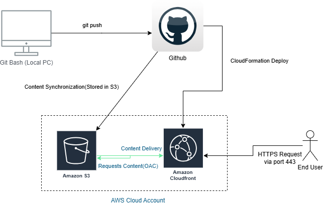

Automated AWS Website Deployment
=================================

This project contains a static website hosted securely on AWS, provisioned using Infrastructure as Code (IaC) via AWS CloudFormation, and continuously deployed via GitHub Actions(CI/CD Pipeline).

📁 Repository Structure
-----------------------

* `.github/workflows/deploy.yml` — GitHub Actions pipeline configuration.
* `cloudformation/template.yaml` — AWS Infrastructure as Code template.
* `images/` — Project documentation diagrams and architecture assets.
* `src/index.html` — Website source code files.

🏗️ Architecture Overview
------------------------

### Diagram



### Component Description

The system architecture automates the hosting and delivery of web content using AWS best practices:

* **GitHub Actions**: Triggers the automated pipeline on code updates, updating infrastructure and syncing code.
* **AWS CloudFormation**: Provisions and manages all underlying AWS resources deterministically.
* **Amazon S3**: Private storage origin bucket (`WebBucket`) holding static website files. Public access is entirely blocked.
* **Amazon CloudFront**: Acts as the Content Delivery Network (CDN) utilizing **Origin Access Control (OAC)** to securely fetch files from the private S3 bucket and serve them globally via HTTPS.

🚀 Getting Started
------------------

### Prerequisites

Before deploying, ensure you have the following:

1. An active **AWS Account**.
2. **IAM Credentials** configured with permissions for S3, CloudFront, and CloudFormation.
3. A **GitHub Repository** to host this codebase.

### GitHub Secrets Configuration

To enable the automated CI/CD pipeline, add the following secrets to your GitHub repository (**Settings > Secrets and variables > Actions**):

* `AWS_ACCESS_KEY_ID`: Your AWS access key.
* `AWS_SECRET_ACCESS_KEY`: Your AWS secret access key.

🔄 CI/CD Pipeline
-----------------

The GitHub Actions workflow (`deploy.yml`) automates the entire deployment lifecycle.

### Trigger Workflow

The pipeline triggers automatically on any **push** to the `main` branch.

### Pipeline Stages

1. **Checkout Code**: Pulls the repository code into the runner environment.
2. **Configure AWS Credentials**: Authenticates with AWS using repository secrets.
3. **Deploy CloudFormation Stack**: Creates or updates the CloudFormation stack named `my-automated-website-stack`.
4. **Sync Website Assets & Invalidate Cache**:
   * Captures outputs (`BucketName` and `DistributionId`) from the CloudFormation step.
   * Syncs the `./src` folder to the target S3 bucket while removing obsolete assets.
   * Clears the CloudFront CDN cache (`/*`) so new website updates go live instantly.

🛠️ Development Workflow
------------------------

To update your website content and trigger the live deployment pipeline, run the following commands in your local terminal (Git Bash):

1. Track your changes:
   ```bash
   git add .
   ```

2. Commit your updates with a descriptive message using standard conventions:
   ```bash
   git commit -m "feat: update website content"
   ```

3. Push directly to the tracking branch to execute the automation:
   ```bash
   git push origin main
   ```

🌐 How to Find Your Website URL
-------------------------------

Once the GitHub Actions deployment completes successfully, follow these steps to find your live website link:

1. Log in to the [AWS Management Console](https://console.aws.amazon.com)as an IAM user.
2. Search for and navigate to the **CloudFormation** service page.
3. Click on the stack named **my-automated-website-stack**.
4. Select the **Outputs** tab in the stack details panel.
5. Locate the key named **WebsiteURL**.
6. Click the URL link provided in the value field (e.g., `https://cloudfront.net`) to view your live site.